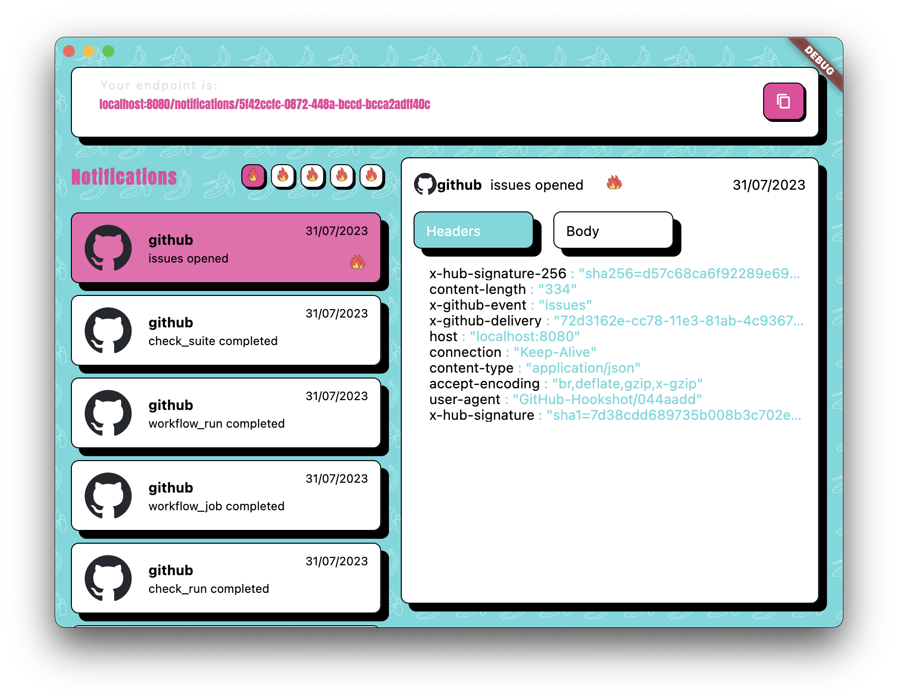

# Readme
Little side project of mine that I worked on to learn dart_frog and try my hand at some components.
I open sourced it by request, so here it is. I hope you can learn something from it.

Screenshot:

# Getting things running

I apologise in advance, this is not a fully running project yet. There are a lot of things that have to be done, to run
this project.
E.g.:

- Creating an amplify project for login (Could also be commented out)
- Creating AWS Secrets for the API Keys
- Creating

## Env vars

There are secrets in the `app/secrets.example.json` which has to be renamed to `app/secrets.json`.
There are secrets in the `server/.env_example` which has to be renamed to `server/.env`.

## TODOS

* Clean secrets -> amplify older, AWS Secret tokens, Clean gcp secret and build pipeline and URL